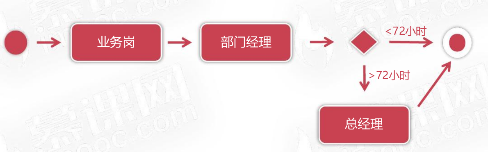

<!--
 * @Description: 
 * @Author: neozhang
 * @Date: 2022-04-06 22:44:30
 * @LastEditors: neozhang
 * @LastEditTime: 2022-04-06 22:50:29
-->
# 慕课办公OA平台  

## 项目介绍  

- 需求说明与环境准备  
- 开发基于RABC的访问控制模块  
- 开发多级请假审批流程  

### 需求  

- 办公自动化系统(Office Automation)是替代传统办公的解决方案  
- OA系统是利用软件技术构建的单位内部办公平台,用于辅助办公  
- 利用OA系统可将办公数据数字化,可极大提高办公流程执行效率  

## 需求介绍  

- 慕课办公OA系统要求采用多用户B/S架构设计开发  
- HR为每一位员工分配系统账户,员工用此账户登录系统  
- 公司采用分级定岗,从1-8依次提升,不同岗位薪资水平不同  
- 6级(含)以下员工为业务岗 ,对应人员执行公司业务事宜  
- 7-8级为管理岗,其中7级为部门经理,8级为总经理  
- 业务岗与管理岗员工可用系统功能不同,要求允许灵活配置  
- 部门经理只允许批准本部门员工申请  
- 部门经理请假需直接由总经理审批  
- 总经理提起请假申请,系统自动批准通过  

  

## 框架&组件  

- MySQL 8  
- Mybatis 3.5  
- Alibaba Druid  
- Servlet 3.1  
- Freemarker 2.3  
- LayUI 2.5  